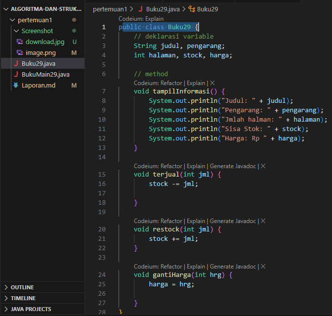

# JOBSHEET II

;

Nama    : Vincentius L.P 
Nim     : 2341720149 
Kelas   : TI-1B 
Absen   : 29 

## 2. Praktikum
### 2.1 Percobaan 1: Deklarasi Class, Atribut dan Method

Mengimplementasikan Class Diagram berikut pada sourch code java.

#### 2.1.1 Langkah-langkah Percobaan

#### 2.1.2 Verifikasi Hasil Percobaan

Eror tersebut dikarenakan tidak adanya fungsi main pada file java tersebut.

#### 2.1.3 Pertanyaan

1. Sebutkan dua karakteristik class atau object! 
    *<b>Jwb</b>: mempunyai sesuatu & melakukan sesuatu 
2. Perhatikan class Buku pada Praktikum 1 tersebut, ada berapa atribut yang dimiliki oleh class Buku? Sebutkan apa saja atributnya! 
    *<b>Jwb</b>: judul, pengarang, halaman, stock, harga 

3. Ada berapa method yang dimiliki oleh class tersebut? Sebutkan apa saja methodnya! 
    *<b>Jwb</b>: menampilkan informasi, menghitung penjualan, menghitung restok, menghitung ganti harga 
4. Perhatikan method terjual() yang terdapat di dalam class Buku. Modifikasi isi method tersebut sehingga proses pengurangan hanya dapat dilakukan jika stok masih ada (lebih besar dari 0)! 
    *<b>Jwb</b>:  
    Perubahan kode program 
    ](Screenshot/no4.png) 
    Perubahan pada output(termasuk output percobaan 2) 
    ](Screenshot/2.png) 

5. Menurut Anda, mengapa method restock() mempunyai satu parameter berupa bilangan int? 
    *<b>Jwb</b>: Method restock() memiliki satu parameter berupa bilangan integer karena parameter tersebut mengindikasikan jumlah tambahan stok yang akan ditambahkan ke dalam persediaan buku. Dengan memberikan parameter berupa bilangan integer, pengguna dapat secara fleksibel menentukan seberapa banyak stok yang ingin ditambahkan saat melakukan restok. 

### 2.2 Percobaan 2: Instansiasi Object, serta Mengakses Atribut dan Method

Melakukan proses instansiasi. 

#### 2.2.1 Langkah-langkah Percobaan

<b>_Kode Program_</b>

public class BukuMain29 {
    public static void main(String[] args) {
        Buku29 bk1 = new Buku29();
        bk1.judul = "Today Ends Tomorrow Comes";
        bk1.pengarang = "Denanda Pratiwi";
        bk1.halaman = 198;
        bk1.stock = 0;
        bk1.harga = 71000;

        bk1.tampilInformasi();
        bk1.terjual(5);
        bk1.gantiHarga(60000);
        bk1.tampilInformasi();

    }
}

#### 2.2.2 Verifikasi Hasil Percobaan