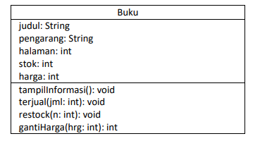

# JOBSHEET II

;

Nama    : Vincentius L.P<br>
Nim     : 2341720149<br>
Kelas   : TI-1B<br>
Absen   : 29<br>

## 2. Praktikum
### 2.1 Percobaan 1: Deklarasi Class, Atribut dan Method

Mengimplementasikan Class Diagram berikut pada sourch code java.



#### 2.1.1 Langkah-langkah Percobaan


#### 2.1.2 Verifikasi Hasil Percobaan


Eror tersebut dikarenakan tidak adanya fungsi main pada file java tersebut.

#### 2.1.3 Pertanyaan

1. Sebutkan dua karakteristik class atau object!<br>
    *<b>Jwb</b>: mempunyai sesuatu & melakukan sesuatu<br>
2. Perhatikan class Buku pada Praktikum 1 tersebut, ada berapa atribut yang dimiliki oleh class Buku? Sebutkan apa saja atributnya!<br>
    *<b>Jwb</b>: judul, pengarang, halaman, stock, harga<br>

3. Ada berapa method yang dimiliki oleh class tersebut? Sebutkan apa saja methodnya!<br>
    *<b>Jwb</b>: menampilkan informasi, menghitung penjualan, menghitung restok, menghitung ganti harga<br>
4. Perhatikan method terjual() yang terdapat di dalam class Buku. Modifikasi isi method tersebut sehingga proses pengurangan hanya dapat dilakukan jika stok masih ada (lebih besar dari 0)!<br>
    *<b>Jwb</b>: <br>
    Perubahan kode program<br>
    ](Screenshot/no4.png)<br>
    Perubahan pada output(termasuk output percobaan 2)<br>
    ](Screenshot/2.png)<br>

    ket: kondisi pertama dibuat agar jika stok lebih dari 0. kondisi kedua agar jika penjualan lebih dari stok, sisa stok tidak negtif.<br>

5. Menurut Anda, mengapa method restock() mempunyai satu parameter berupa bilangan int?<br>
    *<b>Jwb</b>: Method restock() memiliki satu parameter berupa bilangan integer karena parameter tersebut mengindikasikan jumlah tambahan stok yang akan ditambahkan ke dalam persediaan buku. Dengan memberikan parameter berupa bilangan integer, pengguna dapat secara fleksibel menentukan seberapa banyak stok yang ingin ditambahkan saat melakukan restok.<br>

### 2.2 Percobaan 2: Instansiasi Object, serta Mengakses Atribut dan Method

Melakukan proses instansiasi.<br>

#### 2.2.1 Langkah-langkah Percobaan

<b>_Kode Program_</b>

```java
public class BukuMain29 {
    public static void main(String[] args) {
        Buku29 bk1 = new Buku29();
        bk1.judul = "Today Ends Tomorrow Comes";
        bk1.pengarang = "Denanda Pratiwi";
        bk1.halaman = 198;
        bk1.stock = 0;
        bk1.harga = 71000;

        bk1.tampilInformasi();
        bk1.terjual(5);
        bk1.gantiHarga(60000);
        bk1.tampilInformasi();

    }
}
```

#### 2.2.2 Verifikasi Hasil Percobaan
](<Screenshot/verivikasi 2.png>)

#### 2.2.3 Pertanyaan
1. Pada class BukuMain, tunjukkan baris kode program yang digunakan untuk proses instansiasi!<br>
 *<b>Jwb</b>: <br>
    <b>Kode Program</b>

    ```java
    Buku29 bk1 = new Buku29();
    ```
    dan objek yang dihasilkan adalah bk1. 
<br>

2. Bagaimana cara mengakses atribut dan method dari suatu objek?<br>
    *<b>Jwb</b>: Kita dapat mengakses atribut dan method dari suatu objek menggunakan operator (.) (titik).<br>
    Contoh: 
    
    ```java
    bk1.stock = 0;
    ```

3. Mengapa hasil output pemanggilan method tampilInformasi() pertama dan kedua berbeda?<br>
    *<b>Jwb</b>: Dalam contoh di atas, hasil output dari pemanggilan tampilInformasi() pertama dan kedua berbeda karena telah terjadi perubahan pada atribut stok dan harga di antara kedua pemanggilan tersebut.<br>


### 2.3 Percobaan 3: Membuat Konstruktor
#### 2.3.1 Langkah-langkah Percobaan
Kode Program pada File Buku29.java
```java
public Buku29() {

    }

    public Buku29(String jud, String pg, int hal, int stock, int har) {
        judul = jud;
        pengarang = pg;
        halaman = hal;
        this.stock = stock;// Apabila nama parameter sama dengan nama atribut, maka untuk merujuk pada
                           // variabelatribut ditambahkan sintaks this di depan nama atribut
        harga = har;
    }
```

Kode Program pada BukuMain29.java

```java
Buku29 bk2 = new Buku29("Self Reward", "Mheera ayesha", 160, 29, 59000);
        bk2.terjual(11);
        bk2.tampilInformasi();
```

#### 2.3.2 Verifikasi Hasil Percobaan
](<Screenshot/validasi 3.png>)

#### 2.3.3 Pertanyaan
1. Pada class Buku di Percobaan 3, tunjukkan baris kode program yang digunakan untuk mendeklarasikan konstruktor berparameter!<br>
    *<b>Jwb</b>: 

    ```java
    public Buku29(String jud, String pg, int hal, int stock, int har) {
        judul = jud;
        pengarang = pg;
        halaman = hal;
        this.stock = stock;// Apabila nama parameter sama dengan nama atribut, maka untuk merujuk pada
                           // variabelatribut ditambahkan sintaks this di depan nama atribut
        harga = har;
    }
    ```

2. Perhatikan class BukuMain. Apa sebenarnya yang dilakukan pada baris program berikut?

```java
Buku29 bk2 = new Buku29("Self Reward", "Mheera ayesha", 160, 29, 59000);
```
<br>
    *<b>Jwb</b>:  baris program tersebut membuat objek baru bk2 dari kelas Buku29 dengan memberikan nilai-nilai tertentu untuk atribut-atributnya melalui constructor yang menerima lima parameter.
<br>
3. Hapus konstruktor default pada class Buku, kemudian compile dan run program. Bagaimana
hasilnya? Jelaskan mengapa hasilnya demikian!<br>
    *<b>Jwb</b>: <br>


    <br>
    menghapus konstruktor default dari class Buku29, maka Anda tidak akan dapat membuat objek menggunakan sintaks new Buku29(), karena tidak ada konstruktor default yang tersedia untuk digunakan.

<br>
4. Setelah melakukan instansiasi object, apakah method di dalam class Buku harus diakses
secara berurutan? Jelaskan alasannya!<br>
    *<b>Jwb</b>: 
Tidak, method di dalam class Buku tidak harus diakses secara berurutan setelah melakukan instansiasi objek dari class tersebut karena setiap method memiliki tanggung jawab dan fungsionalitasnya sendiri. <br>

5. Buat object baru dengan nama buku<NamaMahasiswa> menggunakan konstruktor berparameter dari class Buku!

```java
Buku29 bukuVincentius = new Buku29("Harry Potter", "Jk.Rowling", 1021, 17, 121000);
        bk2.terjual(11);
        bk2.tampilInformasi();
```


### 2.4 Latihan Praktikum
1. Pada class Buku yang telah dibuat, tambahkan tiga method yaitu hitungHargaTotal(),
hitungDiskon(), dan hitungHargaBayar().

```java
int hitungHargaTotal(int jml){
        int hargaTotal= jml*=harga;
        return hargaTotal;
    }

    int hitungDiskon(int hargaTotal){
        int diskon;
        if(hargaTotal>150000){
            diskon = hargaTotal*=12/100;

        } else if(75000>hargaTotal&&150000<hargaTotal) {
            diskon = hargaTotal*=5/100;

        } else{
            diskon = 0;
        }
        return diskon;
    }

    int hitungHargaBayar(int diskon, int hargaTotal){
        int hargaBayar = hargaTotal-diskon;
        return hargaBayar;
    }
```

2. Buat program berdasarkan class diagram berikut ini!
](Screenshot/image-2.png)

```java
public class Dragon {
    int x, y, width, height;

    void moveLeft() {
        x -= 1;
        if (x < 0 || x > width) {
            detectCollision(x, 0);
        }
    }

    void moveRight() {
        x = +1;
        if (x < 0 || x > width) {
            detectCollision(x, 0);
        }
    }

    void moveDown() {
        y += 1;
        if (x < 0 || x > width) {
            detectCollision(0, y);
        }
    }

    void moveUp() {
        y -= 1;
        if (x < 0 || x > width) {
            detectCollision(0, y);
        }
    }

    void detectCollision(int x, int y) {
        System.out.println("Game Over");
    }

}
```