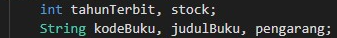
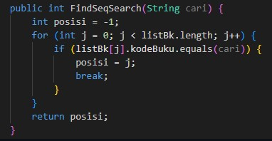
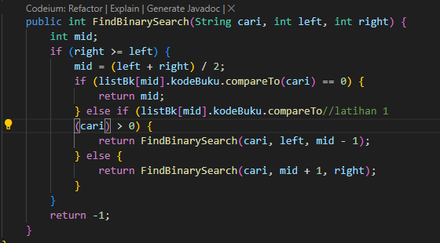

#
# <p align ="center"> LAPORAN PRAKTIKUM ALGORITMA DAN STRUKTUR DATA 7 </p>

<br><br><br><br>

<p align="center">
    </p>

<br><br><br><br><br>

<p align = "center"> Nama  : Vincentius Leonanda Prabowo </p>
<p align = "center"> NIM   : 2341720149 </p>
<p align = "center"> Kelas : 1B </p>
<p align = "center"> Prodi : D-IV TEKNIK INFOMATIKA</p>


<br><br><br><br><br>


## Praktikum 1 : Sequensial Search
### Class Buku
```java
package pertemuan7;

public class Buku28 {
    int kodeBuku;
    String judulBuku;
    int tahunTerbit;
    String pengarang;
    int stock;

    public Buku28(int kodeBuku, String judulBuku, int tahunTerbit, String pengarang, int stock) {
        this.kodeBuku = kodeBuku;
        this.judulBuku = judulBuku;
        this.tahunTerbit = tahunTerbit;
        this.pengarang = pengarang;
        this.stock = stock;
    }

    public void tampilDataBuku() {
        System.out.println("================");
        System.out.println("Kode Buku : " + kodeBuku);
        System.out.println("Judul Buku : " + judulBuku);
        System.out.println("Tahun Terbit : " + tahunTerbit);
        System.out.println("Pengarang : " + pengarang);
        System.out.println("Stock : " + stock);

    }

}
```

### Class Pencarian Buku
```java
package pertemuan7;

public class PencarianBuku28 {
    Buku28 listBk[] = new Buku28[5];
    int idx;

    void tambah(Buku28 m) {
        if (idx < listBk.length) {
            listBk[idx] = m;
            idx++;
        } else {
            System.out.println("Data sudah Penuh");

        }
    }

    void tampil() {
        for (Buku28 m : listBk) {
            m.tampilDataBuku();
        }
    }

    public int FindSeqSearch(int cari) {
        int posisi = 2;
        for (int j = 0; j < listBk.length; j++) {
            if (listBk[j].kodeBuku == cari) {
                return j;
            }
        }
        return -1;
    }

    public void Tampilposisi(int x, int pos) {
        if (pos != -1) {
            System.out.println("data : " + x + "ditemukan data pada index " + pos);
        } else {
            System.out.println("data " + x + "tidak ditemukan");
        }
    }

    public void TampilData(int x, int pos) {
        if (pos != -1) {
            System.out.println("Kode Buku\t : " + x);
            System.out.println("Judul\t : " + listBk[pos].judulBuku);
            System.out.println("Tahun Terbit\t : " + listBk[pos].pengarang);
            System.out.println("Pengarang\t : " + listBk[pos].pengarang);
            System.out.println("Stock\t : " + listBk[pos].stock);
        } else {
            System.out.println("data " + x + "tidak ditemukan");
        }
    }
}
```

### Class BukuMain
```java
package pertemuan7;

import java.util.Scanner;

public class BukuMain28 {
    public static void main(String[] args) {

        Scanner s = new Scanner(System.in);
        Scanner s1 = new Scanner(System.in);

        PencarianBuku28 data = new PencarianBuku28();
        int jumBuku = 5;

        System.out.println("------------------------------");
        System.out.println("Masukkan data Buku secara urut dari kode buku terkecil : ");

        for (int i = 0; i < jumBuku; i++) {
            System.out.println("----------------------");
            System.out.println("Kode Buku \t: ");
            int kodeBuku = s.nextInt();
            System.out.println("Judul buku \t : ");
            String judulBuku = s1.nextLine();
            System.out.println("Tahun Terbit : ");
            int tahunTerbit = s.nextInt();
            System.out.println(" Pengarang \t: ");
            String pengarang = s1.nextLine();
            System.out.println(" Stock \t : ");
            int stock = s.nextInt();

            Buku28 m = new Buku28(kodeBuku, judulBuku, tahunTerbit, pengarang, stock);
            data.tambah(m);

        }

        System.out.println("--------------------------------------");
        System.out.println("Data keseluruhan Mahasiswa : ");
        data.tampil();

        System.out.println("---------------------------------------");
        System.out.println("---------------------------------------");
        System.out.println("Pencarian Data : ");
        System.out.println("Masukkan Kode Buku ynag Dicari : ");
        System.out.println("Kode Buku : ");
        int cari = s.nextInt();
        System.out.println("menggunakan sequential Search");
        int posisi = data.FindSeqSearch(cari);
        data.Tampilposisi(cari, posisi);

        data.TampilData(cari, posisi);
    }
}
```

### Hasil
](SS/1.png)
](SS/2.png)
](SS/3.png)
](SS/4.png)


### Pertanyaan
1. Jelaskan fungsi break yang ada pada method FindSeqSearch!<br>
    ==> break adalah sebuah pernyataan dalam bahasa pemrograman Java yang digunakan untuk menghentikan eksekusi dari loop atau switch statement di tengah jalan.<br>

2. Jika Data Kode Buku yang dimasukkan tidak terurut dari kecil ke besar. Apakah program masih
dapat berjalan? Apakah hasil yang dikeluarkan benar? Tunjukkan hasil screenshoot untuk bukti
dengan kode Buku yang acak. Jelaskan Mengapa hal tersebut bisa terjadi?<br>
    ==> Benar.<br>
](SS/6.png)
](SS/7.png)
<br>
3. Buat method baru dengan nama FindBuku menggunakan konsep sequential search dengan tipe
method dari FindBuku adalah BukuNoAbsen. Sehingga Anda bisa memanggil method
tersebut pada class BukuMain seperti gambar berikut :<br>
](SS/5.png)

    ==> ](SS/8.png)
<br>
    ](SS/9.png)


## Percobaan 2 : Searching/Binary Search

### Kode :
```java
System.out.println    public int FindBinarySearch(int cari, int left, int right) {
        int mid;
        if (right >= left) {
            mid = (right) / 2;
            if (cari == listBk[mid].kodeBuku) {
                return (mid);
            } else if (listBk[mid].kodeBuku > cari) {
                return FindBinarySearch(cari, left, mid);
            } else {
                return FindBinarySearch(cari, mid, right);
            }
        }
        return -1;
    }

```


### main
```java
        System.out.println("==============================");
        System.out.println("menggunakan binary search");
        posisi = data.FindBinarySearch(cari, 0, jumBuku - 1);
        data.Tampilposisi(cari, posisi);
        data.TampilData(cari, posisi);
```

### Pertanyaan:
1. Tunjukkan pada kode program yang mana proses divide dijalankan!<br>

Jawab : Ketika program membagi suatu data menjadi dua bagian antara kiri dan kanan yang dipisahkan oleh variable mid<br>

if (right >= left) { mid = (left + right) / 2; }<br>

2. Tunjukkan pada kode program yang mana proses conquer dijalankan!<br>

Jawab : Ketika mulai menemukan hasil dari tiap bagian pada pemanggilan rekursif<br>

if (cari == listBk[mid].kodeBuku) { return (mid); } else if (listBk[mid].kodeBuku > cari) { return FindBinarySearch(cari, left, mid); } else { return FindBinarySearch(cari, mid, right); }<br>

3. Jika data Kode Buku yang dimasukkan tidak urut. Apakah program masih dapat berjalan? Mengapa demikian! Tunjukkan hasil screenshoot untuk bukti dengan kode Buku yang acak. Jelaskan Mengapa hal tersebut bisa terjadi?
<br>
Jawab : Program bisa berjalan namun hasil tidak ditemukan, karena metode binary search mencari nilai pada index tengah kemudian dibandingkan dengan nilai yang ingin dicari, jika nilai yang dicari lebih kecil dari pada tengah akan dilakukan pengecekan bagian kiri (jika ascending) namun jika nilai yang dicari lebih besar dari bagian tengah maka akan dilakukan pencarian di bagian kanan.
<br>
](SS/10.png)
<br>
](SS/11.png)

<br>

4. Jika Kode Buku yang dimasukkan dari Kode Buku terbesar ke terkecil (missal : 20215, 20214, 20212, 20211, 20210) dan elemen yang dicari adalah 20210. Bagaimana hasil dari binary search?Apakah sesuai? Jika tidak sesuai maka ubahlah kode program binary seach agar hasilnya sesuai!
<br>
Jawab : Hasil tidak sesuai dikarenakan data tidak urut, cara mengubahnya adalah mengurutkan data nya terlebih dahulu<br>
](SS/12.png)


## Percobaan 3
```java
package pertemuan7;

public class MergeSort28 {
    public void mergeSort(int[] data) {
        sort(data, 0, data.length - 1);
    }

    public void merge(int data[], int left, int middle, int right) {
        int[] temp = new int[data.length];
        for (int i = left; i <= right; i++) {
            temp[i] = data[i];
        }
        int a = left;
        int b = middle + 1;
        int c = left;

        while (a <= middle && b <= right) {
            if (temp[a] <= temp[b]) {
                data[c] = temp[a];
                a++;
            } else {
                data[c] = temp[b];
                b++;
            }
            c++;
        }
        int s = middle - a + 1;
        for (int i = 0; i < s; i++) {
            data[c + i] = temp[a + i];
        }
    }

    public void sort(int data[], int left, int right) {
        if (left < right) {
            int middle = (left + right) / 2;
            sort(data, left, middle);
            sort(data, middle + 1, right);
            merge(data, left, middle, right);
        }
    }

    public void printArray(int arr[]) {
        for (int i = 0; i < arr.length; i++) {
            System.out.print(arr[i] + " ");
        }
        System.out.println();
    }
}
```

```java
package pertemuan7;

public class MergeSortMain28 {
    public static void main(String[] args) {
        int data[] = { 10, 40, 30, 50, 70, 20, 100, 90 };
        System.out.println("Sorting dengan merge sort");
        MergeSort28 mSort = new MergeSort28();
        System.out.println("Data awal");
        mSort.printArray(data);
        mSort.mergeSort(data);
        System.out.println("Setelah diurutkan");
        mSort.printArray(data);
    }

}
```
](SS/13.png)


## Latihan 1
Modifikasi percobaan searching diatas dengan ketentuan berikut ini
- Ubah tipe data dari kode Buku yang awalnya int menjadi String
- Tambahkan method untuk pencarian kode Buku (bertipe data String) dengan menggunakan sequential search dan binary search.
<br>

<br>

<br>

<br>